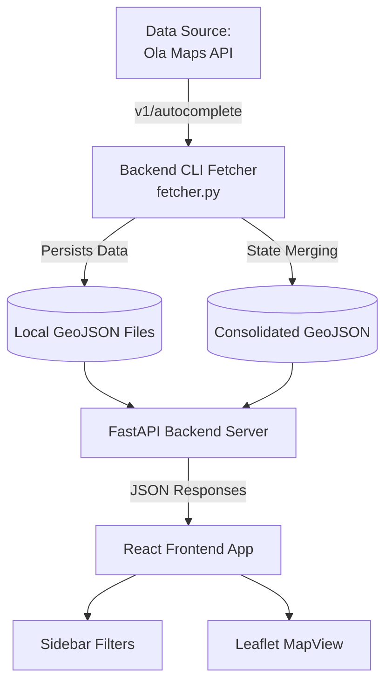

# Architecture & System Design

The India Industrial Area Explorer is structured as a two-tier application: a FastAPI python backend handling robust data fetching, processing and GeoJSON serving, paired with a modern React SPA using Leaflet for rendering spatial properties.

## System Architecture Overview



## Directory Structure
```
.
├── .env                       # Environment configuration (API keys)
├── backend/                   # Python / FastAPI Code
│   ├── main.py                # Server entry-point
│   ├── config.py              # Environment and URL mappings
│   ├── api_routes.py          # GET/POST data endpoints
│   ├── fetcher.py             # CLI application for polling Ola API
│   ├── geojson_writer.py      # Transformations into standard GeoJSON schema
│   ├── data/                  # Root store
│   │   ├── districts.json     # All 700+ target districts mapping
│   │   └── geojson/           # Generated/Aggregated data separated by state
├── frontend/                  # React / Vite Code
│   ├── index.html
│   ├── src/
│   │   ├── api/client.js      # Backend fetch interfaces
│   │   ├── components/        # Sidebar, MapView and Layout components
│   │   ├── App.jsx            # Main view, holding app state
│   │   └── index.css          # Theming, UI styles, Glassmorphism
```

## Backend Workflow
1. **Fetching (`fetcher.py`)**: Interacts with the Ola Krutrim Places API via an Autocomplete approach. Operates continuously, storing checkpoint data over time to handle rate limits and avoid duplicate pulling. Deduplicates returned nodes via `place_id`/`reference`.
2. **Writing (`geojson_writer.py`)**: Responsible for coercing the native API response format (structured text, lat/lng nested geometry) into the flat, standardized GeoJSON `FeatureCollection` schema. Also responsible for merging state-specific files together.
3. **Serving (`api_routes.py`)**: Serves status statistics, lists collected states, and provides endpoints to stream dynamically gathered GeoJSON to the client.

## Frontend Interaction
The frontend utilizes a split architecture. State is initialized at the `App.jsx` level. `client.js` queries `localhost:8000/api` natively via standard `fetch` promises. 

The `Sidebar` leverages filtering heuristics locally while rendering stats from the server. The `MapView` strictly acts as a Leaflet wrapper taking `geojsonData` as a top-level prop. Map rendering optimizations are applied using `leaflet.markercluster` to prevent the heavy DOM load associated with thousands of nodes across a nationwide view. The application defaults to hovering tooltips (`bindTooltip`) over standard clicking to improve UI/UX when investigating specific spatial attributes.

## Key Design Decisions
- **Decoupled Data Pipeline**: Fetcher scripts run independently of the API layer ensuring no timeouts occur on large block requests.
- **Incremental GeoJSON Writing**: Individual state-based files guarantee easy debugging and fast individual reads before the optional `merge_all_states()` builds a unified `.geojson` artifact.
- **Domain Spoofing**: The fetcher scripts specifically forge `Referer` to circumvent browser-only CORS limitations set on Ola's dashboard.
- **Marker Clustering**: Rendering is significantly heavily localized ensuring performance regardless of screen resolution or depth of data.
